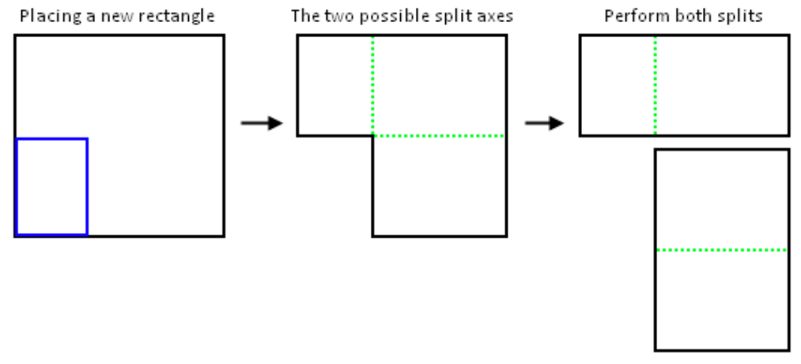
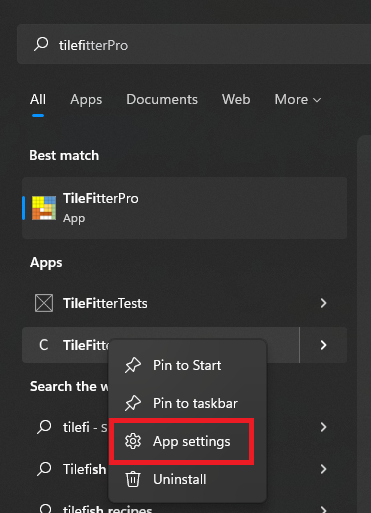
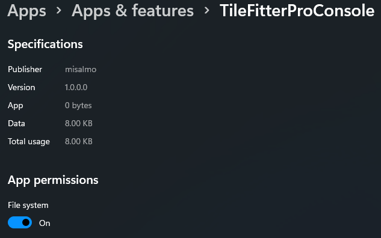
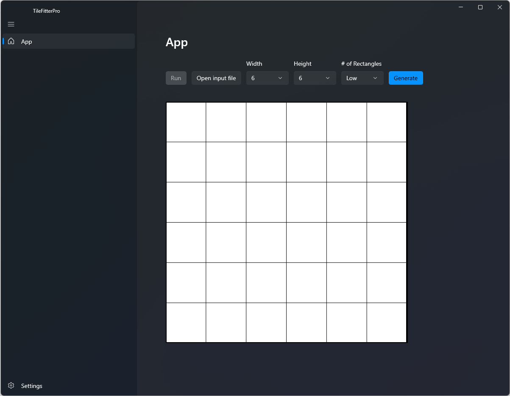

# TileFitterPro

## Problem
A given list of tiles needs to be packed to fit into a single large container in any order or position that will fit. The tiles may not be rotated or scaled.

## Input
The input is a list of rectangles to place within a given container of specified width and height. It should be in the specified CSV file under the following format: 
```
width,height
3,3
3,2
2,3
2,2
1,4
3,1
```

# Output
The output will be a list of rectangles width, height, top and left positions that make the solution. It will be in the specified CSV file under the following format:
```
width,height,top,left
3,3,0,0
3,2,0,3
2,3,3,0
2,2,2,3
1,4,2,5
3,1,4,2
```
All coordinates are relative to the top-left of the rectangle which is coordinate (0,0). Therefore, an output of ```3,3,1,2``` is a rectangle of width 3 and height 3 located at coordinates (2,1) from the top left.

## Implementation
Being an NP-Hard problem, many great minds have spent time researching how to solve this problem. One such mind is Jukka Jylänki, who has detailed many algorithms and heuristics in this [paper](http://clb.demon.fi/files/RectangleBinPack.pdf) was implemented. This algorithm is detailed in the [Maximal Rectangles](#maximal-rectangles) section. All solutions output by this application have been computed by an implementation of this algorithm using a multitute of heuristics and optimizations also presented in the aforementioned research. Although only one algorithm is used to solve the given problems, many different heuristics running in parallel improves the chance of finding at least one solution. While some heuristics are generally good, some are moreso given a specific kind of input, meaning that it works best for those. Running multiple of these algorithms with various of heuristics would yield the highest confidence on the output provided. Because of this one principle, the [Tile Fitter](#tilefitter) library was implemented in such a way that it allows running many algorithms and heuristics at the same time for better efficiency and results.

## Project Structure
The solution is organized in 4 C# projects.

### TileFitter
This class library contains the different algorithms and models as well as many abstraction classes making it easier to consume. As mentioned, it was abstracted in a way that makes it flexible and extensible to allow the addition of further algorithms or heuristics to solve a wider range of problems.

### TileFitterPro
This UWP application is an interactive way to interact with the [TileFitter](#tilefitter) library and visualize the results. It is also possible to generate input sets and visually see them before running the algorithm and seeing their packed placement. More on how to use those features in the [How to use UWP app](#how-to-use-uwp-app) section. To answer the given requirements, it can also be launched as a console application to specify the initial arguments.

### TileFitterProConsole
This console application is a command line interfface to interact with the [TileFitter](#tilefitter) library to output solutions to a specified problem.

### TileFitterTests
This tests library contains unit tests of the TileFitter library. It is incomplete.

### Implemented Algorithms

#### Maximal Rectangles
This algorithm is essentially an extension and improvement on the Guillotine algorithm, also explained in the paper above. Like it, it stores a list of free eligible rectangles where tiles could be placed. However, instead of choosing one of the split axes like it is done in the Guillotine algorithm, both splits are taken, resulting in overlapping free rectangles, as shown in the following picture.


This splitting method is the basis of this algorithm. These splits are what consist of the free rectangles evaluated to decide where to place any given tile. To solve a problem, this algorithm is ran in two different ways: optimally and blindly, combining different heuristics.

The *optimal* method is what is referred to as *Offline* in the paper, meaning the algorithm is aware of the whole input set and may choose which tile to place first. To do so, it evaluates every tile against every free rectangle, calculating the specified heuristic metrics for any given tile placement, and chooses the one that optimizes the metrics. It then places it in that spot, meaning the top left corner of the chosen free rectangle with the metrics. Then we need to reevaluate all free rectangles because some are invalidated by this tile placement. The first one is the one we chose for the tile placement, which is immediately removed. Then, the maximal rectangles splits shown above are calculated and added to the free rectangles. The next step is to invalidate any other free rectangles on which the placed tile overlap and generate new free rectangles resulting from that overlap. Every free rectangle is evaluated against the placed tile and if they intersect, the overlapping portion of the placed tile is pruned from that free rectangle. To do so, two new overlapping free rectangles are generated from pruning the placed tile overlap on that specific free rectangle, similarly to the maximal rectangles splits, and the original free rectangle is removed from the free rectangles collection. Once the free rectangles were recalculated, to optimize the free rectangles collection, the whole  collection is scanned to remove any redundant entries, meaning any free rectangle contained in another one will be removed from the list. After that, it tries to place the next tile, and the cycle continues.

The *blind* method is a bit different because it cannot optimize tile placement. Instead, we use sorting heuristics to sort the initial collection of tiles. That way, we can influence which tile is placed first by the algorithm, combined with the other heuristics used for the choice of the free rectangle, or in other words, where to place the tile. The algorithm is very similar, but instead of pitting every tile to place against each other to find the one with the best metrics to plate first, they are placed in the free rectangle chosen by the specified heuristic in the order that they are given to the algorithm. The rest of the free rectangles management and heuristic execution is the same as the *optimal* method.

More details such as the pseudo code and other details of the algorithm can be found in the paper mentioned above.

##### Heuristics
The Maximal Rectangles algorithm runs on an heuristic for its choice of free rectangle in which to place a tile. When running using the optimization technique implemented, it will go through each tile to place, test it against each free rectangle, and choose the tile to place and the free rectangle to place it in by comparing different metrics. These metrics are what the heuristics dictate. The free rectangle choice heuristics implemented are detailed in the next sections.

###### Best Short Side Fit
Best Short Side Fit, called BSSF, tries to minimize the smaller side difference. In other words, it computes the difference between the free rectangle and tile's width and heights, and tries to minimize the shortest of these differences, minimizing the longest one for tie-breaks. This heuristics means it will try to maximize the smaller gab left by the tile along one axis.

###### Best Long Side Fit
Best Long Side Fit, called BLSF, tries to minimize the bigger side difference. In other words, it computes the difference between the free rectangle and tile's width and heights, and tries to minimize the longest of these differences, minimizing the shortest one for tie-breaks. This heuristics means it will try to minimize the bigger gap left by the tile along one axis.

###### Best Area Fit
Best Area Side Fit, called BAF, tries to maximize the space taken by the tile in the free rectangle. In other words, it computes the difference between the free rectangle and tile's areas, and tries to minimize it, minimizing the shortest side fit for tie-breaks.

###### Bottom Left Rule Fit
Best Left Rule, called BLR, tries to minimize the space taken along the y axis. In other words, it chooses the free rectangle in which its top Y coordinate would be the lowest, using the Left X coordinate for tie-breaks.

###### Blind Heuristics
Aditionnaly, the Maximal Rectangles algorithm can be run "blind", meaning it has to place the rectangles in the order they were given to it. In this implementation, many sorting heuristics were used to carefully sort the lists before running them through the algorithm which would then placed them in that order. Changing the order based on those heuristics means the algorithm makes different decisions as to where the best placement for each rectangle resulting in different different solutions. While they will not all work, trying as many of these orders, combined with the above heuristics of determining where to best place a rectangle, improves the change of finding a solution.

The following sorting heuristics are implemented and used on tiles to place to find a solution:
1. Width descending with Height as a tie-breaker
2. Height descending with Width as a tie-breaker
3. Area descending with Width as a tie-breaker
4. Perimeter descending with Width as a tie-breaker

## How to install
To install both the Console and UWP apps, navigate to their respective folders (TileFitterPro/TileFitterPro(Console)/AppPackages), and using an elevated powershell command line, execute the ```install.ps1``` scripts to install the app.

Then, in order for both the Console App and UWP app to work, you need to give them acces to your files. To do so, right click on the app icon and select *app settings* as such:


Then, you need to enable broad file system access as such:


## How to use Console app
To use the Console app, one must execute it using the following format: ```TileFitterProConsole --InputSet <inputFilePath> --ContainerWidth <width> --ContainerHeight <height> --Output <outputFilePath>``` where width and height are integers.

Note that if a file already exists at the output file path, it will be replaced with the solution.

## How to use UWP app
This UWP app can be used to set the different input of the problem and visualizing the solution. 


As is shown in the above image, the input file can be specified with a file picker. In addition, the container width and height can be specified in the drop-down menus. These left-most components make up the inputs of the application. Once these are set, it is possible to click on the *Run* button to run the application and attempt to find a solution for the specified input. 

Another feature that was implemented in this app is the ability to generate input sets that **should** be valid using the *Generate* button and specifying the preferred *Density*. The density describes the number of generated tiles of varying sizes in relation to the container's size. A higher density will mean more tiles are generated, resulting in smaller tiles compared to other densities, for a given container size. Clicking on *Generate* will generate an input set and display the tiles on the screen in a way they fit the specified container. Clicking on the *Run* button will run the application to attempt to find a solution to these tiles and display the solution if it is able to fit them, which is possible. This is particularly helpful to test different algorithms and heuristics and visualize the results on working input sets. This could be tweaked further to use various rectangle size distributions.

Note: in between the generation and execution, each tile will change color, making them difficult to track.

It can also be ran via the command line to set the initial inputs following the same format specified in the [Console App](#how-to-use-console-app) section but changing the application name: ```TileFitterPro --InputSet <inputFilePath> --ContainerWidth <width> --ContainerHeight <height> --Output <outputFilePath>

## References
1. Jukka Jylänki's article ["A Thousand
Ways to Pack the Bin - A Practical Approach to Two-Dimensional Rectangle Bin
Packing."](https://github.com/juj/RectangleBinPack/blob/master/RectangleBinPack.pdf)
2. Jukka Jylänki's open source [C++ implementation](https://github.com/juj/RectangleBinPack/)
3. David Colson's blog post [Exploring rectangle packing algorithms](https://www.david-colson.com/2020/03/10/exploring-rect-packing.html)
4. Eric Huang and Rechard E. Korf' paper [New Improvements in Optimal Rectangle Packing](https://www.ijcai.org/Proceedings/09/Papers/092.pdf)
5. [Binary Tree Packing Algorithm](https://blackpawn.com/texts/lightmaps/default.html)
6. Matt Perdeck's CodeProject article on [Rectangle Packing Algorithm for Building CSS Sprints](https://www.codeproject.com/Articles/210979/Fast-optimizing-rectangle-packing-algorithm-for-bu)
